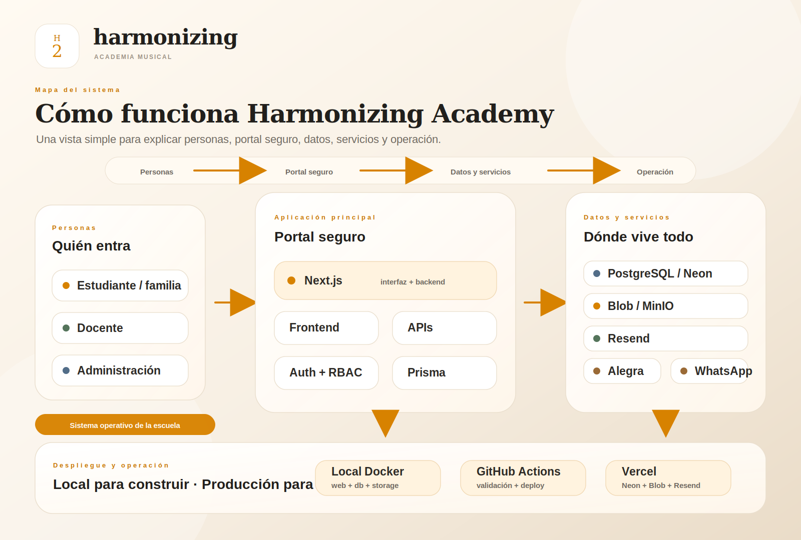

# Arquitectura para propietarios: Harmonizing Academy

Harmonizing Academy es el portal digital de la academia de música. Su objetivo es reemplazar trabajo manual, mensajes dispersos, notas en papel y seguimiento informal con una operación clara para estudiantes, familias, docentes y administración.

## Qué resuelve

- **Clases y agenda:** clases recurrentes, clases individuales, reagendaciones, disponibilidad docente y zonas horarias.
- **Progreso musical:** notas post-clase, habilidades, repertorio, tareas, práctica, videos y reportes mensuales.
- **Comunicación:** mensajes, notificaciones, recordatorios por email y enlaces de acceso seguro.
- **Operación administrativa:** estudiantes, docentes, planes manuales, facturas de Alegra, consentimientos y seguimiento de actividad.
- **Historial:** importación revisada de documentos antiguos para convertir años de progreso manual en datos útiles.

## Quién usa la app

- **Estudiante / familia:** ve clases, tareas, canciones, reportes, videos pendientes, facturas y consentimientos.
- **Docente:** gestiona clases, completa el flujo post-clase, asigna repertorio, revisa videos y escribe feedback.
- **Administración:** controla usuarios, agenda, planes, facturación externa, consentimientos, reportes e importaciones.

## Diagrama visual

También hay una versión PDF lista para compartir: [harmonizing-owner-architecture.pdf](./assets/harmonizing-owner-architecture.pdf).

## Cómo interactúan las piezas

1. La familia, docente o administración entra desde iPad, celular o computador.
2. Next.js muestra la interfaz y también ejecuta las reglas del backend dentro de la misma app.
3. NextAuth valida acceso, roles y permisos para que cada persona vea solo lo que corresponde.
4. Prisma conecta el backend con PostgreSQL/Neon, donde viven usuarios, clases, progreso, reportes y consentimientos.
5. Los videos, hojas de canciones y archivos se guardan en almacenamiento de objetos: MinIO en local y Blob/S3-compatible en producción.
6. Resend envía emails importantes, como enlaces mágicos, consentimientos firmados y recordatorios de clase.
7. Alegra conserva la facturación como fuente externa; Harmonizing muestra una copia sincronizada en modo lectura.
8. WhatsApp sigue siendo el canal externo para pagos y soporte cuando el proceso aún no vive dentro de la app.

## Tecnologías en lenguaje simple

| Pieza | Qué hace | Por qué importa |
| --- | --- | --- |
| Next.js + React | Construye las pantallas y backend de la app | Permite tener portal y reglas en una misma plataforma |
| TypeScript | Ayuda a evitar errores de código | Hace más seguro crecer el producto |
| Tailwind + componentes propios | Define el diseño visual premium | Mantiene la app consistente en iPhone, iPad y desktop |
| NextAuth | Maneja inicio de sesión y roles | Protege estudiante, docente y administración |
| Prisma | Es la capa ordenada para consultar datos | Reduce errores al leer/escribir en la base de datos |
| PostgreSQL / Neon | Guarda la información principal | Es la fuente de verdad del negocio |
| MinIO / Blob | Guarda archivos grandes | Videos, partituras, imágenes y adjuntos no saturan la base de datos |
| Resend | Envía emails transaccionales | Acceso por magic link, consentimientos y recordatorios |
| Alegra | Sistema externo de facturación | La app muestra facturas sin procesar pagos directamente |
| Docker / Vercel | Ejecuta local y producción | Desarrollo estable local y despliegue confiable |

## Idea clave

Harmonizing Academy no es solo una página web: es el sistema operativo de la escuela. Cada clase puede convertirse en evidencia de progreso, cada tarea en seguimiento real y cada reporte en una conversación más clara con la familia.
